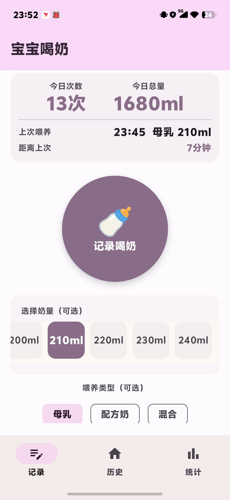
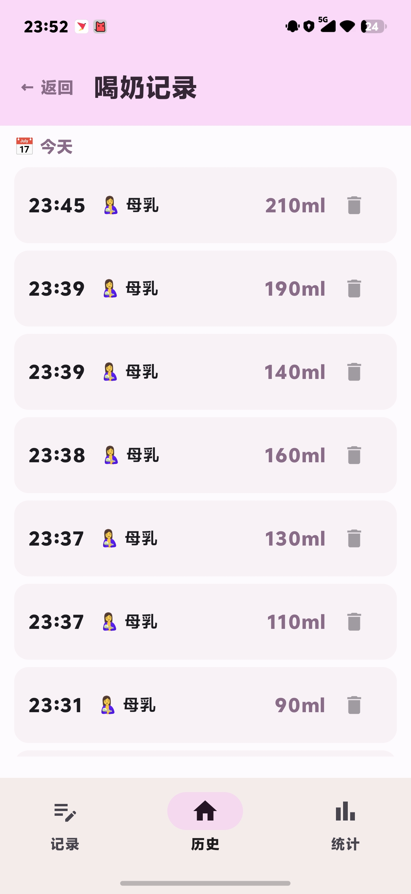
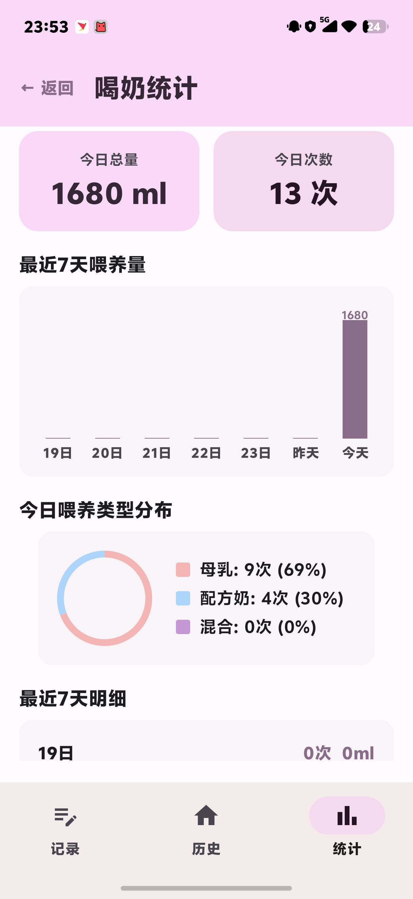

# 宝宝喝奶记录 🍼

一款极简的 Android 宝宝喂养记录应用。**一键记录，无需繁琐操作。**


## 截图

| 记录页面 | 历史页面 | 统计页面 |
|---|---|---|
|  |  |  |

## 设计理念

记录宝宝的每一次喝奶，操作要足够简单——因为麻烦就不想记了。

打开应用，点击中间的大按钮，喝奶记录即刻保存。喂养量和类型都是可选的，不填也能记录。

## 功能

- **📝 一键记录** — 大圆形按钮，单击即可记录当前时间，配合震动反馈
- **⚡ 快速选量** — 记忆上次选择的奶量，支持 30/60/90/120ml 快速选择
- **🏷️ 喂养类型** — 母乳 / 配方奶 / 混合，可选标识
- **📋 历史记录** — 按日期分组展示全部记录，支持左滑删除
- **📊 数据统计** — 今日/本周喂养总量和次数、每日柱状图、喂养类型比例
- **🔄 自动同步** — 同一 WiFi 下多设备自动发现并同步数据，无需任何配置
- **❤️ 捐赠** — 如果你喜欢这个应用，欢迎请我喝瓶可乐

## 技术栈

| 层 | 选型 |
|---|---|
| 语言 | Kotlin |
| UI | Jetpack Compose + Material 3 |
| 数据库 | Room (SQLite) |
| 架构 | MVVM (ViewModel + StateFlow) |
| 导航 | Navigation Compose |
| 网络 | java.net.* (TCP + UDP) |
| 最低版本 | Android 8.0 (API 26) |

### 自动同步原理

应用使用 **UDP 广播发现 + TCP 数据同步** 实现局域网内多设备数据一致：

1. 应用在前台时，每 30 秒通过 UDP 广播发现同一 WiFi 下的其他设备
2. 发现设备后自动建立 TCP 连接，交换新增的喂养记录
3. 通过 `syncId`（UUID）进行去重，确保数据不会重复
4. 同步完成后通过 Room Flow 自动刷新 UI
5. 应用进入后台后自动停止同步以省电

全程静默运行，无需任何手动操作。

## 下载

从 [Releases](https://github.com/mypigrain/baby/releases) 页面下载最新 APK。

## 构建

需要 Android Studio 或命令行构建环境。

```bash
# 设置 Android SDK 路径
echo "sdk.dir=/path/to/Android/Sdk" > local.properties

# 构建 debug APK
./gradlew assembleDebug
```

APK 输出路径：`app/build/outputs/apk/debug/app-debug.apk`

## 项目结构

```
app/src/main/java/com/example/baby/
├── BabyApp.kt              # Application 入口
├── MainActivity.kt         # 唯一 Activity
├── data/
│   ├── FeedingRecord.kt    # Room 实体
│   ├── FeedingDao.kt       # 数据访问层
│   ├── AppDatabase.kt      # 数据库定义 + 迁移
│   └── sync/               # WiFi 自动同步
│       ├── SyncManager.kt      # 数据导出/导入/去重
│       ├── NetworkSyncManager.kt # TCP 服务端/客户端 + UDP 发现
│       └── SyncCoordinator.kt   # Lifecycle 协调器
├── ui/
│   ├── home/               # 记录页面 + ViewModel
│   ├── history/            # 历史记录页面
│   ├── stats/              # 数据统计页面 + ViewModel
│   ├── donate/             # 捐赠页面
│   ├── navigation/         # 底部导航栏
│   └── theme/              # Material 3 主题
└── util/
    └── DateUtils.kt        # 日期工具类
```

## 捐赠

如果你觉得这个应用对你有帮助，欢迎扫码请我喝一瓶可乐 🥤

| 微信 | 支付宝 |
|---|---|
|  |  |

## License

MIT
